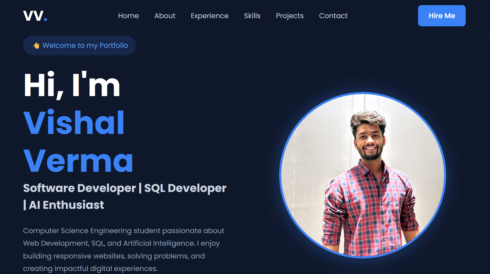

# 💼 Vishal Verma - Personal Portfolio

## 📌 OIBSIP Web Development and Designing Internship

**Level:** Level 1  
**Task:** Task 2 - Personal Portfolio

## 📖 Description

This project is a responsive personal portfolio website developed using HTML5, CSS3, and JavaScript. It showcases my profile, technical skills, internship experience, projects, resume, and contact information with a modern and responsive user interface.

## 🚀 Features

- Responsive Design
- Modern Navigation Bar
- Hero Section
- About Me Section
- Experience Section
- Skills Section
- Projects Section
- Contact Section
- Smooth Scrolling Navigation
- Responsive Mobile Layout
- Resume Download Option
- GitHub and LinkedIn Links
- Interactive UI with JavaScript

## 🛠️ Technologies Used

- HTML5
- CSS3
- JavaScript
- Google Fonts (Poppins)
- Git & GitHub

## 📂 Project Files

- `index.html` - Main portfolio webpage
- `style.css` - Website styling and responsive design
- `script.js` - JavaScript functionality
- `Resume.pdf` - My resume
- `images/` - Profile and project images
- `README.md` - Project documentation

## 📸 Screenshot

## 💻 Projects Included

### 🎬 Netflix Clone

Responsive Netflix-inspired website built using HTML, CSS, JavaScript, and TMDB API.

### 🌐 Responsive Landing Page

Modern and responsive landing page created using HTML5 and CSS3.

### 💼 Personal Portfolio

Responsive personal portfolio website showcasing my skills, experience, projects, and contact information.

## 🌐 Live Demo

[View Live Portfolio](https://oibsip-sable-zeta.vercel.app/)

## 👨‍💻 Author

**Vishal Verma**

B.Tech Computer Science Engineering Student

### 🔗 Connect With Me

- **GitHub:** [Vishalverma234](https://github.com/Vishalverma234)
- **LinkedIn:** https://www.linkedin.com/in/vishal-verma-a1763b302/

## 🎯 Internship

**Oasis Infobyte (OIBSIP)**  
Web Development and Designing Internship

## 📄 License

This project is created for educational and internship purposes.